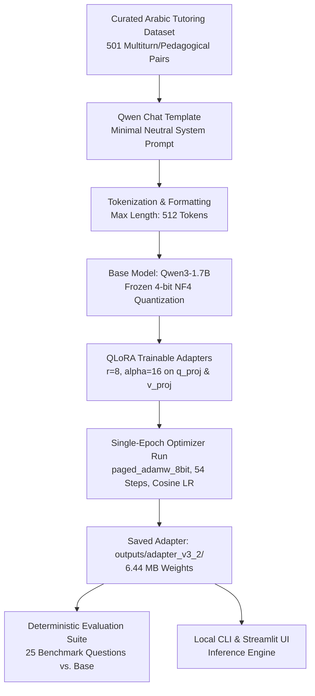

# Arabic AI Tutor — Fine-Tuned Qwen3-1.7B with QLoRA

An engineering demonstration of parameter-efficient fine-tuning (**QLoRA**) to adapt **Qwen3-1.7B** into a specialized Arabic AI and Machine Learning tutor on consumer hardware (single laptop GPU).

---

## Overview

General-purpose multilingual language models frequently struggle when explaining complex technical subjects in Arabic: they default to verbose conversational preambles, transliterate technical terms haphazardly, confuse computational concepts with colloquial or medical homonyms, and fail to calibrate answer depth for different learner levels.

The **Arabic AI Tutor** project investigates whether parameter-efficient fine-tuning on a small, curated behavioral dataset can reliably instill structured pedagogical behaviors into a compact open-weights model (**Qwen3-1.7B**).

> [!IMPORTANT]
> **Behavior Fine-Tuning, NOT a RAG System:**  
> This project is designed strictly for **behavior adaptation** (teaching the model *how* to teach, explain, structure, and calibrate responses). It is **not** a Retrieval-Augmented Generation (RAG) system. The pretrained model serves as the foundational knowledge base, while QLoRA modifies the response style and reasoning presentation. Fine-tuning alone does not guarantee real-time factual accuracy or replace document retrieval for live production databases.

---

## Why Fine-Tuning?

Prompt engineering can guide model responses, but detailed system prompts consume valuable context budget and can be easily diluted across multi-turn interactions. Fine-tuning with QLoRA directly embeds the desired pedagogical behaviors into low-rank adapter matrices:

- **Brevity & Conciseness**: Answering in one or two direct sentences when explicitly requested, eliminating conversational fluff (*"بالطبع! إليك..."*).
- **Domain Grounding**: Preventing lexical confusion (e.g., maintaining the computational definition of *الهلوسة / Hallucination in LLMs* rather than confusing it with medical psychiatric conditions).
- **Pedagogical Structure**: Producing clean 4-part explanations (*Definition, Intuition, Practical Scenario, Summary*) upon request without needing system prompt reminders.
- **Audience Calibration**: Explaining technical ideas through everyday analogies for beginners, or diving into loss formulations for advanced inquiries.

---

## Architecture & Workflow



---

## Dataset

The model was trained on **501** hand-curated and audited Arabic AI tutoring examples, split deterministically into train, validation, and test subsets:

| Split | Count | Percentage | Purpose |
| :--- | :---: | :---: | :--- |
| **Train** | **426** | 85.0% | Model weight adaptation |
| **Validation** | **50** | 10.0% | Midpoint and final loss tracking |
| **Test** | **25** | 5.0% | Held-out qualitative evaluation benchmark |
| **Total** | **501** | 100% | Full dataset |

### Behavior Categories Covered:
1. **Concise Direct Definitions**: Strict 1-to-2 line summaries of core ML concepts.
2. **Beginner Analogies**: Translating abstract concepts (e.g., Overfitting, Embeddings) into relatable everyday metaphors.
3. **Deep Technical & Mathematical Explanations**: Bias-Variance tradeoff, gradient descent mechanics, loss formulation.
4. **Real-World Engineering Scenarios**: Production failure cases, feature store design, e-commerce recommendation traps.
5. **Misconception Corrections**: Addressing common traps (e.g., "100% training accuracy means a perfect model").
6. **Troubleshooting Guides**: Concrete debugging checklists for diverging loss, OOM errors, or data leakage.
7. **Comparisons**: Contrasting related concepts (e.g., Overfitting vs. Underfitting, Precision vs. Recall).
8. **Structured Breakdowns**: Explicit 4-section format (*Definition, Intuition, Example, Summary*).

> [!NOTE]
> **Minimal Neutral System Prompt**:  
> To guarantee that tutoring behaviors were absorbed directly by the fine-tuned adapter weights rather than coerced via prompt engineering, the exact same minimal neutral prompt was used during both training and evaluation:  
> `"You are a helpful Arabic AI assistant. Answer the user's question accurately."`

---

## QLoRA Configuration

| Parameter | Value | Description |
| :--- | :--- | :--- |
| **Base Model** | `Qwen/Qwen3-1.7B` | 1.7-billion parameter compact open-weights model |
| **Quantization** | NF4 (4-bit NormalFloat) | Reduces base model VRAM to ~1.26 GiB |
| **Double Quantization** | `true` | Quantizes quantization constants to save memory |
| **Compute Precision** | `bfloat16` (`bf16`) | Maintains numerical stability during forward/backward passes |
| **LoRA Rank ($r$)** | `8` | Dimension of low-rank update matrices |
| **LoRA Alpha ($\alpha$)** | `16` | Scaling factor ($\alpha / r = 2.0$) |
| **LoRA Dropout** | `0.05` | Regularization on adapter layers |
| **Target Modules** | `q_proj`, `v_proj` | Attention query and value projection layers |
| **Total Parameters** | 1,722,180,608 | Base Qwen3-1.7B architecture |
| **Trainable Parameters** | **1,605,632** | **~0.0932%** of total parameter count |
| **Max Sequence Length** | 512 | Context window budget per example |

---

## Training Run

The training was executed locally on a single consumer laptop GPU with zero cloud dependencies:

- **Hardware**: NVIDIA GeForce RTX 5070 Laptop GPU (7.96 GiB VRAM)
- **Batch Size**: 1 micro-batch $\times$ 8 gradient accumulation steps (**effective batch size = 8**)
- **Optimizer**: `paged_adamw_8bit` (handles VRAM spikes via memory paging)
- **Learning Rate**: $1 \times 10^{-4}$ with a Cosine Annealing schedule
- **Warmup**: 10% of total steps (5 warmup steps)
- **Gradient Checkpointing**: Enabled
- **Duration**: **1 single epoch** completed in **255.4 seconds (~4.2 minutes)**
- **Total Optimizer Steps**: **54 steps** ($\lceil 426 / 8 \rceil$)
- **Peak VRAM Allocated**: **3.17 GiB** (well below the 7.96 GiB ceiling)

### Loss Profile

| Step | Epoch Fraction | Training Loss | Learning Rate | Validation Loss |
| :---: | :---: | :---: | :---: | :---: |
| 5 | 0.09 | 3.2494 | $6.67 \times 10^{-5}$ | — |
| 15 | 0.28 | 2.7190 | $9.33 \times 10^{-5}$ | — |
| 25 | 0.47 | 2.5051 | $6.91 \times 10^{-5}$ | — |
| **27** | **0.51** | — | — | **2.5738** *(Midpoint)* |
| 35 | 0.66 | 2.4626 | $3.71 \times 10^{-5}$ | — |
| 45 | 0.85 | 2.4001 | $1.03 \times 10^{-5}$ | — |
| **54** | **1.00** | **2.4434** | $0.00$ | **2.5073** *(Final)* |

Validation loss decreased consistently from **2.5738** to **2.5073** without divergence.

---

## Base vs Fine-Tuned

The following example shows how the fine-tuned model produces a clearer, more structured tutoring response compared with the base Qwen3-1.7B model.


> The fine-tuned model shows improved structure and presentation on this example, while the project limitations are documented below. For the complete unedited 7-prompt comparative logs, see [`examples/base_vs_finetuned.md`](examples/base_vs_finetuned.md).

---

## Results & Findings

- **Arabic Language Retention**: 22/25 (88.0%) of fine-tuned responses remained in Arabic.
- **Repetition Loop Resistance**: 24/25 (96.0%) of fine-tuned responses were completely loop-free under greedy decoding.
- **Preamble Reduction**: Eliminated generic greetings (*"بالطبع!"*, *"أهلاً بك!"*) in favor of immediate technical explanations.
- **No Fabricated Benchmarks**: We do not claim a blanket "X% improvement" over the base model. The value of this experiment lies in demonstrated behavioral specialization within a compact parameter footprint (0.0932% trainable weights).

---

## Limitations

1. **Language Drift on Latin Term Prefixes**: In 3 prompts starting directly with an English term (e.g. `Overfitting`), the model switched to English. A bilingual system prompt or stronger synthetic Arabic prefixes in data can resolve this.
2. **Failure on Regional Dialects**: In 1 prompt using Egyptian colloquial phrasing (Prompt 23), the model misinterpreted the query and entered a repetitive checklist loop (`شاشة تحقق التحقق...`).
3. **Small Evaluation Suite**: 25 held-out questions provide strong qualitative signals but do not constitute a formal statistical benchmark (e.g., MMLU-Arabic).
4. **Knowledge Boundaries**: The adapter does not inject external knowledge. Highly specialized or post-cutoff inquiries must be handled via RAG or search integration.

---

## Project Structure

```text
├── configs/
│   └── training_config.yaml         # Training hyperparameters, LoRA & quantization configs
├── data/
│   └── v3_2/
│       ├── clean_dataset_v3_2.jsonl # Complete curated dataset (501 items)
│       ├── splits/                  # Deterministic train (426), val (50), test (25)
│       └── evaluation_questions.json# 25 held-out evaluation prompts
├── docs/
│   └── results_summary.md           # Executive metric summary
├── examples/
│   └── base_vs_finetuned.md         # Detailed qualitative comparison logs
├── outputs/
│   ├── adapter_v3_2/                # Final trained LoRA adapter (6.44 MB)
│   └── comparison_v3_2.json         # Raw evaluation outputs (Base vs. Tuned)
├── src/
│   ├── compare_models.py            # Side-by-side deterministic evaluation script
│   ├── dataset_integrity.py         # Near-duplicate & leakage validation
│   ├── inference.py                 # CLI & programmatic inference module
│   ├── prepare_data.py              # Data preprocessing and split pipeline
│   ├── train.py                     # QLoRA training script with memory tracking
│   └── utils.py                     # Configuration loader, device & model utilities
├── app/
│   └── app.py                       # Local Streamlit chat interface
├── Base Qwen3-1.7B vs. Fine-Tuned.png # Visual side-by-side comparison
├── requirements.txt                 # Pinned Python dependencies
└── README.md                        # Documentation & experiment guide
```

---

## Installation

### Prerequisites
- Windows 10/11 or Linux
- Python 3.11 or 3.12 (64-bit)
- NVIDIA GPU with $\ge 6$ GiB VRAM (CUDA 12.x supported)

### Setup
```powershell
# 1. Clone the repository
git clone https://github.com/Abo0wael/Arabic-Ai-Tutor-Qlora.git
cd Arabic-Ai-Tutor-Qlora

# 2. Create and activate a virtual environment
python -m venv .venv
.venv\Scripts\activate

# 3. Install CUDA-enabled PyTorch (example for CUDA 12.8 / 12.x)
pip install torch torchvision torchaudio --index-url https://download.pytorch.org/whl/cu128

# 4. Install repository dependencies
pip install -r requirements.txt
```

---

## Usage

### 1. Interactive CLI Inference
Run the fine-tuned tutor interactively in your terminal:
```powershell
python -m src.inference --config configs/training_config.yaml
```

Ask a single question:
```powershell
python -m src.inference --config configs/training_config.yaml --question "اشرح لي مفهوم الـ Overfitting بمثال عملي"
```

Run using the base model only (without adapter):
```powershell
python -m src.inference --config configs/training_config.yaml --base --question "ما هو Overfitting؟"
```

### 2. Local Streamlit Web Interface
Launch the browser UI:
```powershell
streamlit run app/app.py
```

### 3. Re-Running Model Comparison
Evaluate both base and fine-tuned models on the held-out test suite:
```powershell
python -m src.compare_models --config configs/training_config.yaml
```

### 4. Reproducing Data Preparation & Training (Reference)
```powershell
# Preprocess and tokenize data
python -m src.prepare_data --config configs/training_config.yaml

# Train QLoRA adapter (1 epoch, ~4.2 minutes on RTX 5070)
python -m src.train --config configs/training_config.yaml
```

---

## Hardware Environment

- **Machine**: Laptop GPU Workstation
- **GPU**: NVIDIA GeForce RTX 5070 Laptop GPU
- **VRAM**: 7.96 GiB GDDR6
- **CUDA Runtime**: 12.8
- **PyTorch**: 2.11.0+cu128
- **OS**: Windows 11 (build 26100)

---

## Future Improvements

- **Bilingual System Prompting**: Incorporate explicit Arabic response gating to prevent English code-switching when queries start with Latin terms.
- **Dialect Expansion**: Enrich the dataset with multi-dialect queries (Egyptian, Levantine, Gulf) to improve robustness against informal Arabic phrasing.
- **Repetition Penalty Tuning**: Test dynamic repetition penalties or top-$p$ nucleus sampling during open-ended generation to eliminate checklist loops.
- **RAG Integration**: Couple the fine-tuned behavioral adapter with a vector retrieval pipeline for verified technical documentation lookup.
